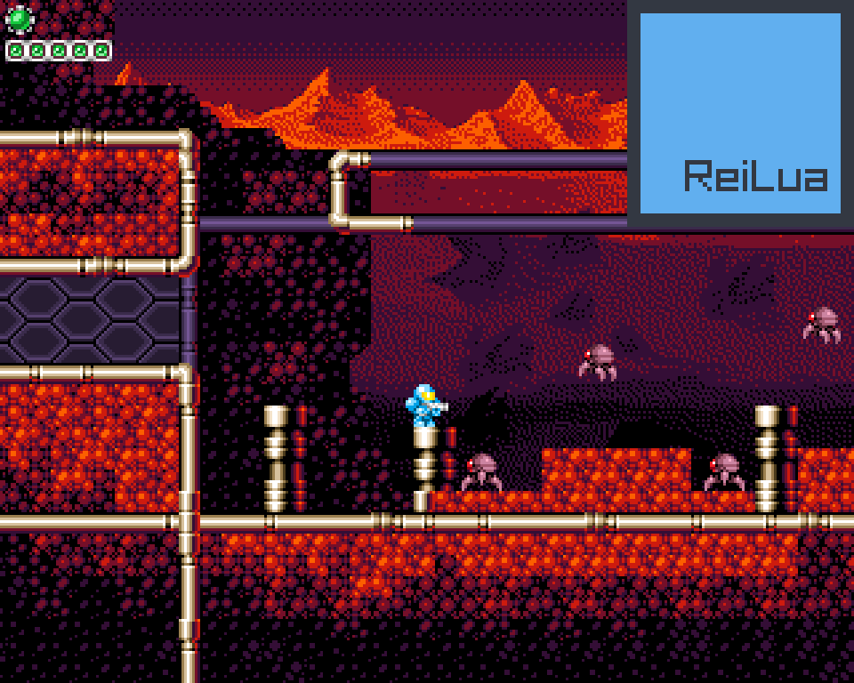

# Space War Man

Example game for ReiLua. Requires ReiLua exe on root folder.

Features:
* Framerate independent platformer physics.
* Tiled map loader.
* Map/Room transitions.
* Tile collision and resolve.
* Enemy with basic behavior.
* Health tank power up.
* Double jump power up.
* Random health drops.
* Controller support.
* Basic main menu.
* Basic entity system.
* Simple particle system.
* Adjustable settings and settings save (write to file).
* OOP.
* Support for multiple languages.
* Audio playback.
